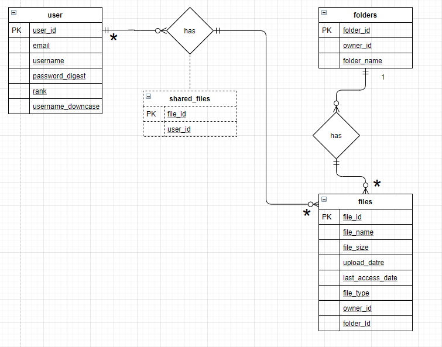

# Projektplan

## 1. Projektbeskrivning (Beskriv vad sidan ska kunna göra)
Man ska kunna ladda upp filer och dela dem med andra användare samt lägga dem i dina mappar.
## 2. Vyer (visa bildskisser på dina sidor)
## 3. Databas med ER-diagram (Bild)

## 4. Arkitektur (Beskriv filer och mappar - vad gör/inehåller de?)
app.rb --> alla routes samt vissa helper funktioner

model.rb -> alla databas funktioner

views -> alla vyer

views/users/ -> alla filer som visar något som kan ändra på användarna t.ex. logga in/registrera

views/files/ -> alla filer som har något att göra med filerna, dvs att visa vilka filer som finns, ändra på en fil och skapa en fil

views/folders/ -> alla filer som har något att göra med mapparna, dvs välja mapp, visa vilka filer som finns i mappen, skapa mapp

public -> allt användare kan se

public/uploads -> här lagras alla uppladdningar av filer i form av en mapp för varje fil id och filen ligger i den mappen. t.ex. 105/pictures.png
